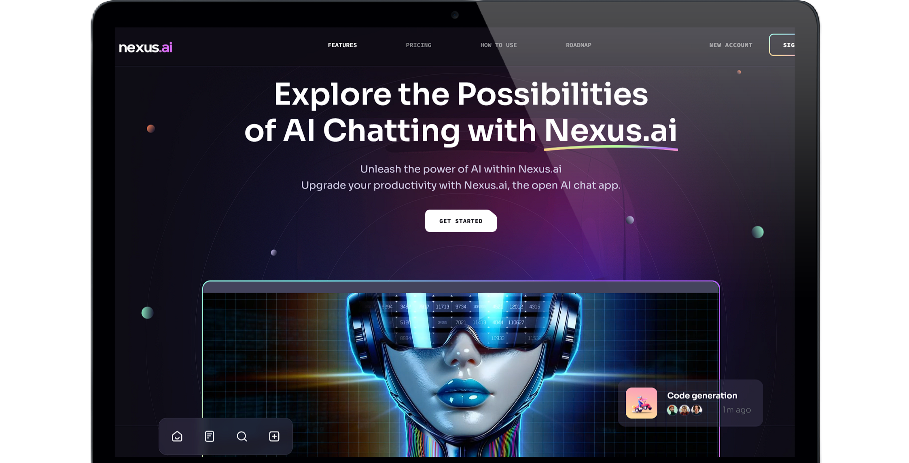

# Nexus AI Landing Page 🚀🤖



## Project Overview 🌟
Nexus AI is a cutting-edge landing page showcasing artificial intelligence solutions and innovations.

## Live Website 🌐
[Nexus AI - Live Demo](https://nexus-ai-blond.vercel.app)

## Repository 📂
[GitHub Repository](https://github.com/vipulkatwal/nexus-ai-landing-page)

## Features ✨
- Modern AI-themed design
- Responsive layout
- Sleek user interface
- Highlighting AI capabilities

## Technologies Used 💻
- React
- Tailwind CSS
- Vercel Deployment

## Getting Started 🏁

### Prerequisites
- Node.js
- npm or yarn

### Installation 🔧
1. Clone the repository
```bash
git clone https://github.com/vipulkatwal/nexus-ai-landing-page.git
```

2. Install dependencies
```bash
cd nexus-ai-landing-page
npm install
```

3. Run the development server
```bash
npm start
```

## Deployment 🚀
The project is deployed on Vercel for seamless hosting and continuous deployment.

## Contributing 🤝
Contributions, issues, and feature requests are welcome!

## License 📄
[Add your license information here]

## Contact 📧
- GitHub: [@vipulkatwal](https://github.com/vipulkatwal)
- Project Link: [Nexus AI Landing Page](https://github.com/vipulkatwal/nexus-ai-landing-page)

Made with ❤️ and 🤖 AI Technology